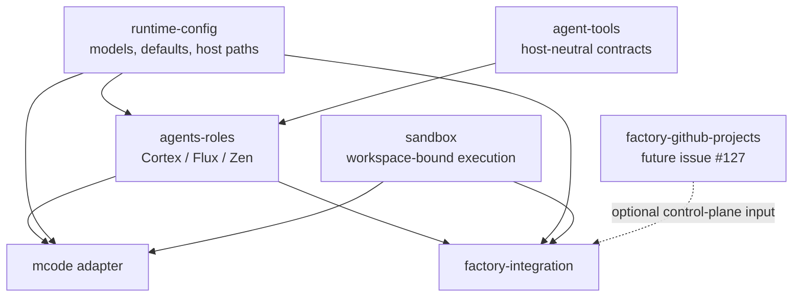

# MCode and Factory compatibility

MCode and Factory are sibling hosts over the same canonical runtime. Neither host adapter imports the other.

## Shared and host-owned surfaces

| Surface | Canonical owner | MCode | Factory |
| --- | --- | --- | --- |
| Agent IDs, prompts, and factories | `agents-roles` | consumes | consumes through `createFactoryAgentBundle` |
| Model profile and runtime defaults | `runtime-config` | resolves once at startup | resolves once at startup |
| Executable `command_run` | `sandbox` | checkout-bound | session-workspace-bound |
| Modes and native Code subagents | `mcode` | mounts | unsupported; not emulated |
| Project specialists and workflows | `project-mounting-manager` | mounts validated generations | only explicit Factory workflow integration |
| Authentication and persistence | host | local process | `factory-integration` |

`createFactoryAgentBundle` is deliberately branded. Factory cannot accept an arbitrary object shaped like a role bundle, and canonical role code cannot acquire Factory clients, storage handles, project schedulers, or credentials. Agent-facing API capabilities must be narrow Mastra tools backed by request-scoped ports injected by the host.

## Local data

Default local state is segregated by host:

- MCode: `~/.mastra-toolkit/mcode`
- Studio: `~/.mastra-toolkit/studio`
- Factory: `~/.mastra-toolkit/factory`

`MASTRA_APP_DATA_DIR` overrides the selected host directory. Startup performs a one-time migration of recognized legacy MCode or Factory database files and fails on conflicting source and destination data instead of silently overwriting either copy.

## GitHub Projects V2

Issue #127 belongs in a future `packages/factory-github-projects` control-plane package. That package may translate GitHub project items into bindings, leases, reconciliation events, and Factory scheduling requests. It must not import agents, agent tools, MCode, project mounting, or sandbox implementations, and it must not expose raw GitHub clients or credentials to agents. `factory-integration` remains the only consumer and composition boundary.

## Lifecycle and validation

Both hosts own their process resources and await shutdown exactly once. Factory closes its Factory instance before the shared Mastra runtime; mounted MCode closes project resources, controller timers, PubSub, and Mastra before resetting provider state.

Compatibility evidence consists of the root typecheck, tests, and build plus the host flows in [host validation](host-validation.md). Factory construction does not imply MCode mode parity, and no unsupported upstream surface is patched or copied.
