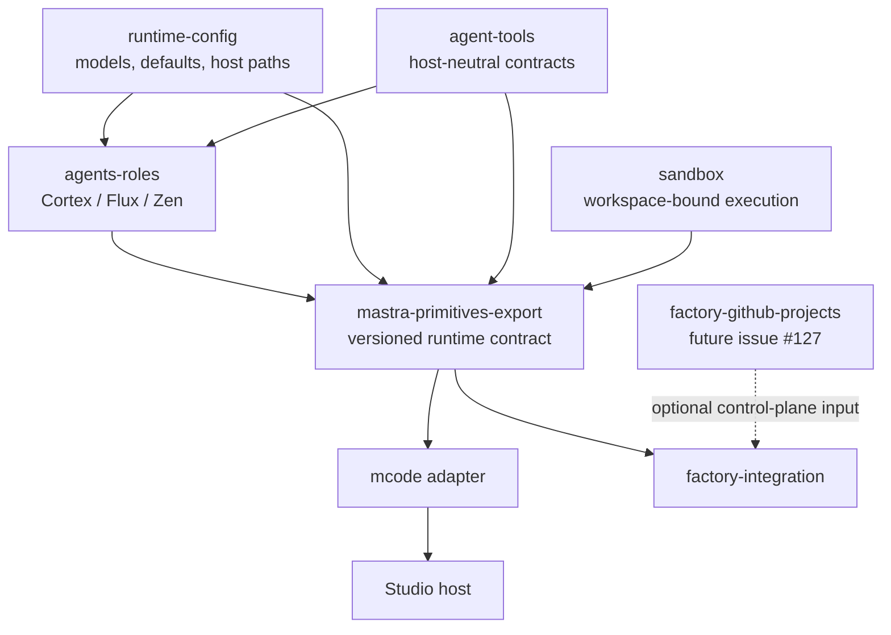

# MCode, Studio, and Factory compatibility

MCode, Studio, and Factory are sibling hosts over the same canonical runtime. Neither host adapter imports another host.

## Shared and host-owned surfaces

| Surface | Canonical owner | MCode | Studio | Factory |
| --- | --- | --- | --- | --- |
| Versioned aggregate and capability digest | `mastra-primitives-export` | MCode projection | Studio projection | Factory projection |
| Agent IDs, prompts, models, and registry | `agents-roles` | canonical leaf agents | canonical supervisors over canonical leaves | canonical leaves registered, but not controller-selectable |
| Model profile and runtime defaults | `runtime-config` | resolves once at startup | resolves once at startup | resolves once at startup |
| Delegation | host projection | AgentController-native `subagent` | generic Mastra `agents` maps; Code modes retain the native controller surface | upstream-blocked; no role-specific or neutral adapter |
| Native workspace file/search/execute tools | Mastra workspace | checkout-bound | checkout-bound | session-workspace-bound |
| Project specialists and workflows | `project-mounting-manager` | mounts validated generations | mounts validated generations | only explicit Factory workflow integration |
| Authentication and persistence | host | local process | Studio server | `factory-integration` |

Every host projection exposes the same contract digest. The digest is calculated only from deterministic, secret-free policy; runtime identity, workspaces, sandbox instances, browser implementation, and approval context remain in the host-local `ToolkitRuntimeBinding`. Two Factory requests therefore share policy while resolving distinct project, user, session, and workspace values.

`FactoryControllerProjection` is deliberately branded. Factory cannot accept an arbitrary object shaped like a projection, and canonical role code cannot acquire Factory clients, storage handles, project schedulers, or credentials. `createFactoryAgentBundle` and `McodeRecipeV2` remain deprecated compatibility aliases, not composition boundaries. Agent-facing API capabilities must be narrow Mastra tools backed by request-scoped ports injected by the host.

The generic Mastra supervisor surface and AgentController-native subagents are intentionally distinct. Studio's registered Cortex, Flux, and Zen agents each expose all three canonical leaves through an `agents` map. MCode modes use non-recursive canonical agents and receive exactly `cortex`, `flux`, and `zen` from the controller's built-in `subagent` tool. Native leaves do not receive that tool, and no unsupported promise is made that their nested approvals can use the parent controller's interactive approval gate.

The version-pinned behavior, lifecycle limits, and exact Factory construction blocker are recorded in the [delegation capability matrix](delegation-capability-matrix.md).

## Recall extension direction

Recall adherence remains an extension-only concern. Toolkit prompts and wrappers must omit unused optional recall fields and follow Mastra's visible-part cursor semantics; they must not fill optional fields with sentinel text. Any clearer schema, visible-part indexing, or direct background-task result retrieval should use supported Mastra/observational-memory extension points or be proposed upstream. This runtime does not fork or patch Mastra for recall behavior.
## Local data

Default local state is segregated by host:

- MCode: `~/.mastra-toolkit/mcode`
- Studio: `~/.mastra-toolkit/studio`
- Factory: `~/.mastra-toolkit/factory`

`MASTRA_APP_DATA_DIR` overrides the selected host directory. Startup performs a one-time migration of recognized legacy MCode or Factory database files and fails on conflicting source and destination data instead of silently overwriting either copy.

## GitHub Projects V2

Issue #127 belongs in a future `packages/factory-github-projects` control-plane package. That package may translate GitHub project items into bindings, leases, reconciliation events, and Factory scheduling requests. It must not import agents, agent tools, MCode, project mounting, or sandbox implementations, and it must not expose raw GitHub clients or credentials to agents. `factory-integration` remains the only consumer and composition boundary.

## Lifecycle and validation

Both hosts own their process resources and await shutdown exactly once. Factory closes its Factory instance before the shared Mastra runtime; mounted MCode closes project resources, controller timers, PubSub, and Mastra before resetting provider state.

Compatibility evidence consists of equivalent contract digests, binding-isolation tests, target enumeration, supervisor/leaf topology tests, exactly-one-controller assertions, the root typecheck/tests/build, and the host flows in [host validation](host-validation.md). `@mastra/factory@0.5.0` owns its controller construction and exposes no supported modes, subagents, or pre-construction callback, so Factory reports that projection as upstream-blocked and exposes no delegation adapter. No unsupported surface is patched or copied.
