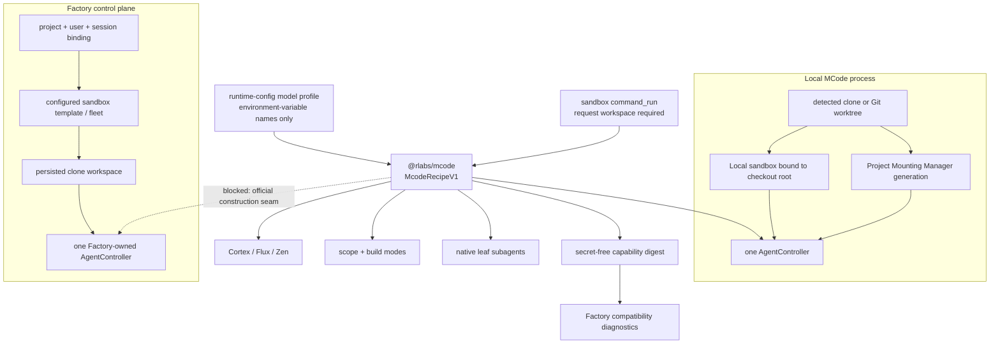

# MCode recipe and Factory compatibility

`@rlabs/mcode` owns one versioned `McodeRecipeV1`. Both executable hosts construct that recipe once from the startup-resolved model profile and the sandbox-owned `command_run` tool. The recipe contains the canonical Cortex, Flux, and Zen agents, the six scope/build modes, the three native leaf subagents, the model settings input, and a deterministic secret-free capability descriptor.

The capability descriptor is safe to persist or report. Runtime credentials, host settings, repository contents, controller state, and sandbox leases are deliberately absent. A changed descriptor digest is a CI/CD compatibility signal; it is not a runtime source scanner or a mutable registry.

The final `Recipe --> FactoryController` edge is a compatibility boundary today. Factory consumes the recipe for canonical delegated agents, provider settings, sandbox tools, and diagnostics, but installed and reviewed upstream `@mastra/factory` releases do not expose a supported input for modes or native subagents before constructing their controller. Diagnostics therefore report `controllerConstruction: unsupported-upstream`; the toolkit does not patch Factory, construct a second controller, or silently claim parity. Issue #125's local acceptance is the narrower, behaviorally verified delegates-plus-sandbox contract. Native Factory mode/subagent construction remains part of issue #119 until an official upstream release provides the seam.

## Execution and configuration boundaries

| Surface | Local MCode | Factory GitHub session |
|---|---|---|
| `command_run` | Resolves the checkout workspace and executes through its sandbox | Resolves the bound session workspace and executes through that sandbox |
| Canonical agents | Recipe-owned | Recipe-owned delegated agents |
| Scope/build modes and native leaf subagents | Mounted from the recipe | Declared by the recipe; controller mounting is blocked by upstream |
| Repository skills | Checkout-scoped | Native upstream lookup is expected in the bound clone, but toolkit parity remains unverified |
| Published workflows | Project Mounting Manager | `project_workflow` executes inside the bound clone sandbox |
| Instructions, hooks, commands, plugins, MCP, specialists | Checkout-scoped through Code/Project Mounting Manager | Explicitly unsupported until request-aware sandbox adapters exist |
| Credentials | Resolved by the local process at runtime | Owned by Factory or delivered task-scoped to the selected sandbox |

`command_run` has no process-working-directory fallback. Its parser, scheduling, approval, trace, and output contracts remain in `@rlabs/agent-tools`; the executable Mastra tool is exported only by `@rlabs/sandbox`. Top-level agents, native leaf subagents, delegated/ADHD children, and Project Mounting Manager specialists receive that same tool contract. Delegated request contexts retain the bound workspace, so children cannot drift to the Factory source checkout.

Factory adds a control-plane authorization gate around that contract. Direct `command_run` and Cortex/Flux/Zen delegation require Factory session coordinates, a native persisted Factory workspace ID, and a sandbox filesystem. The upstream local fallback workspace is rejected before its executor is called, including when repository execution is disabled.

Factory resolves `packages/runtime-config/config/models.yaml` once at startup and passes that profile to Factory configuration, the canonical MCode recipe, Code SDK provider settings, and the `ProxyGateway`. Factory registers the recipe's canonical agents on its single `Mastra` instance so their model references resolve through that same configured gateway as the native controller. The Factory host constructs the recipe with the session-authorized `command_run`, so direct agent APIs and delegate tools share the same fail-closed project binding. Delegate results retain completed child tool results for controller and UI evidence. Read-only `command_run` adapters execute through the bound clone without an additional approval; nested mutation and shell approvals remain suspended because the current upstream Factory controller does not surface a child agent's approval gate through an integration tool. Factory does not bypass that gate. Native nested-approval parity remains tracked with the upstream controller work in issue #119.

Standard Git clones and Git worktrees are both supported locally. The folder used for execution is the root detected from the CLI's starting directory. Factory clones or reattaches the repository under its persisted project/user/session workspace binding; it does not execute repository commands from the Factory application directory and does not assign one shared sandbox to a Factory process or agent runtime.

Factory diagnostics classify only `published-workflows` as behaviorally verified. They report repository `skills` separately as `upstreamUnverified`. Local issue #125 acceptance requires the canonical delegate tools and sandbox execution to work in a persisted repository session; it does not reclassify native repository configuration surfaces that Factory does not yet expose.

Ephemeral local Factory development uses Infisical for the proxy credential and the built-in local authentication path. WorkOS is intentionally optional there. The `persistent-operations` profile remains fail-closed on WorkOS, durable database and Redis state, Platform sandbox identity, production cookie policy, and HTTPS origins. Hosted authentication and native Factory mode parity therefore remain deployment work under issue #119 rather than hidden prerequisites for local operation.

## Release admission

CI should build and validate the exact toolkit revision, record the MCode capability digest, and run the Factory consumer contracts. Prompt, mode, subagent, and safe-default changes do not require rebuilding the sandbox image. Changes to the sandbox filesystem, runtime layers, workflow runner, or toolchain require a new immutable image candidate and native runtime validation. No Mastra fork is permitted for this scope; Factory mode parity waits for a supported upstream release.
