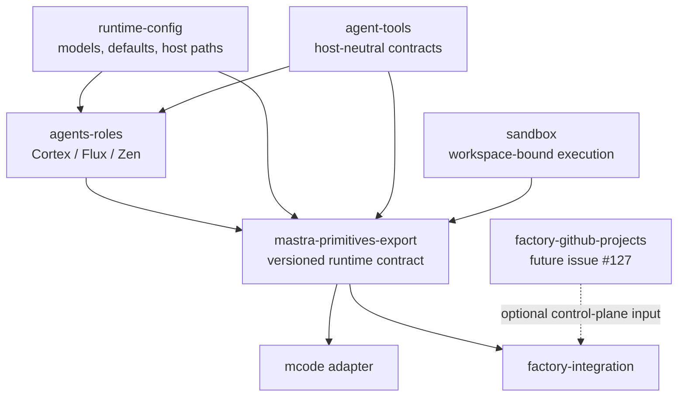

# MCode and Factory compatibility

MCode and Factory are sibling hosts over the same canonical runtime. Neither host adapter imports the other.

## Shared and host-owned surfaces

| Surface | Canonical owner | MCode | Factory |
| --- | --- | --- | --- |
| Versioned aggregate and capability digest | `mastra-primitives-export` | MCode/Studio projection | Factory projection |
| Agent IDs, prompts, and factories | `agents-roles` | consumes through the aggregate | consumes through the aggregate |
| Model profile and runtime defaults | `runtime-config` | resolves once at startup | resolves once at startup |
| Native workspace file/search/execute tools | Mastra workspace | checkout-bound | session-workspace-bound |
| Command Run and ADHD compatibility libraries | `agent-tools` / `sandbox` | not agent-visible | not agent-visible |
| Modes and native Code subagents | shared contract, host projection | mounts on its one controller | upstream-blocked; not emulated with a second controller |
| Project specialists and workflows | `project-mounting-manager` | mounts validated generations | only explicit Factory workflow integration |
| Authentication and persistence | host | local process | `factory-integration` |

Every host projection exposes the same contract digest. The digest is calculated only from deterministic, secret-free policy; runtime identity, workspaces, sandbox instances, command authorization, browser implementation, and approval context remain in the host-local `ToolkitRuntimeBinding`. Two Factory requests therefore share policy while resolving distinct project, user, session, and workspace values.

`FactoryControllerProjection` is deliberately branded. Factory cannot accept an arbitrary object shaped like a projection, and canonical role code cannot acquire Factory clients, storage handles, project schedulers, or credentials. `createFactoryAgentBundle` and `McodeRecipeV1` remain deprecated compatibility aliases, not composition boundaries. Agent-facing API capabilities must be narrow Mastra tools backed by request-scoped ports injected by the host.

## Recall extension direction

Recall adherence remains an extension-only concern. Toolkit prompts and wrappers must omit unused optional recall fields and follow Mastra's visible-part cursor semantics; they must not fill optional fields with sentinel text. Any clearer schema, visible-part indexing, or direct background-task result retrieval should use supported Mastra/observational-memory extension points or be proposed upstream. This runtime does not fork or patch Mastra for recall behavior.

## Local data

Default local state is segregated by host:

- MCode: `~/.mastra-toolkit/mcode`
- Studio: `~/.mastra-toolkit/studio`
- Factory: `~/.mastra-toolkit/factory`

`MASTRA_APP_DATA_DIR` overrides the selected host directory. Startup performs a one-time migration of recognized legacy MCode or Factory database files and fails on conflicting source and destination data instead of silently overwriting either copy.

## GitHub Projects V2

Issue #127 belongs in a future `packages/factory-github-projects` control-plane package. That package may translate GitHub project items into bindings, leases, reconciliation events, and Factory scheduling requests. It must not import agents, agent tools, MCode, project mounting, or sandbox implementations, and it must not expose raw GitHub clients or credentials to agents. `factory-integration` remains the only consumer and composition boundary.

## Lifecycle and validation

Both hosts own their process resources and await shutdown exactly once. Factory closes its Factory instance before the shared Mastra runtime; mounted MCode closes project resources, controller timers, PubSub, and Mastra before resetting provider state.

Compatibility evidence consists of equivalent contract digests, binding-isolation tests, exactly-one-controller assertions, the root typecheck/tests/build, and the host flows in [host validation](host-validation.md). The current stable Factory API owns its controller construction and does not expose a supported modes/native-subagents input, so Factory reports that projection as upstream-blocked. No unsupported surface is patched or copied.
