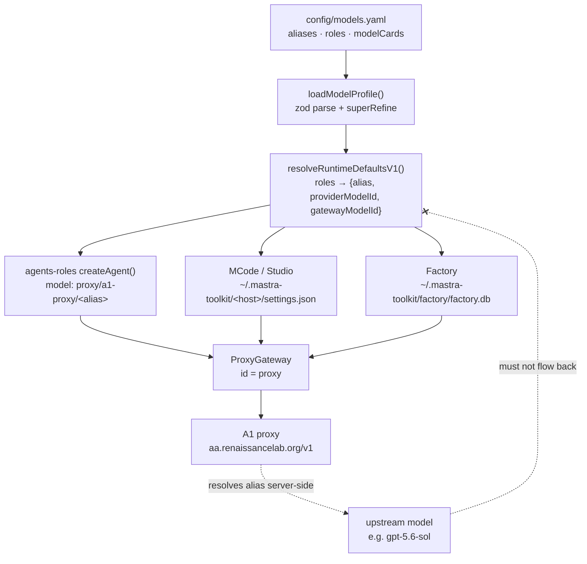

# Agent harness model selection

How a model is chosen in this repository, end to end: where it is declared, how a role becomes a
concrete request, which store persists it per host, and where that chain is known to break.

Every claim below is pinned to `main` at commit
[`41d0475`](https://github.com/rlabs88/mastra-toolkit/commit/41d0475).
Line references are read from that tree. Code and configuration define actual behaviour; when they
disagree with this page, the code is right and this page is stale.

Related: [`packages/runtime-config/CONTEXT.md`](../packages/runtime-config/CONTEXT.md) owns the
per-model card and observational-memory rationale, and
[issue #182](https://github.com/rlabs88/mastra-toolkit/issues/182) is the open bug that made this
page necessary.

## The governing requirement

a1-proxy models must be used across both MCode and Factory; a raw upstream model id must never
become a selected model. #requirement/architecture/critical

The repository policy that carries this is in the root
[`AGENTS.md`](../AGENTS.md) under *Configuration and secrets*: resolve a model profile once at
process startup, validate it, and project that same resolved profile into the Studio gateway, the
Factory Code SDK provider, and the Mastra Code adapter; preserve explicit user model selections;
fail closed rather than substituting a fallback.

## The path



## 1. Canonical declaration

`packages/runtime-config/config/models.yaml` is the single canonical model catalog; no other file
declares an alias, a role default, or a model card. #decision/architecture/foundational

| Block | Lines | What it declares |
| --- | --- | --- |
| `provider` | 2–7 | `id: a1-proxy`, `kind: openai-compatible`, `baseUrl: https://aa.renaissancelab.org/v1`, `apiKeyEnv: CLI_PROXY_API_KEY` |
| `aliases` | 8–21 | A flat `string[]` of 13 resolvable alias names — the entire catalog |
| `roles` | 22–32 | Seven role → alias bindings: `cortex`, `flux`, `zen`, `ayra`, `specialist`, `observer`, `reflector` |
| `code` | 33–35 | `defaultAgent: cortex`, `defaultMode: build` |
| `memory` | 40–42 | Profile-level fallback budget for an alias that declares no card |
| `modelCards` | 78–195 | Per-alias override cards, keyed by a declared alias |

The file is secret-free: it stores the *name* of the credential environment variable
(`CLI_PROXY_API_KEY`), never a value. #constraint/security/hard

Six of the seven roles resolve to `code-frontier-high`; `observer` and `reflector` resolve to
`code-workhorse-high` (`models.yaml:23-32`).

The catalog is located by package resolution, not by a relative path:
`DEFAULT_MODEL_PROFILE_PATH` is
`createRequire(import.meta.url).resolve("@rlabs/runtime-config/models.yaml")`
(`packages/runtime-config/src/profile.ts:24`).

## 2. Load and validation

`loadModelProfile()` (`packages/runtime-config/src/profile.ts:318-320`) reads the YAML, parses it
through `modelProfileSchema`, and returns a frozen object. The schema
(`profile.ts:105-193`) is `.strict()` at every level, so an unrecognised key is a load failure
rather than ignored configuration.

Five validations decide whether a profile is usable at all:

1. `provider.id` is the literal `"a1-proxy"` and `provider.kind` the literal `"openai-compatible"`
   (`profile.ts:108-110`). A second provider cannot be introduced by editing YAML alone.
2. `roles` is a closed `.strict()` object of exactly the seven named roles (`profile.ts:115-126`).
   Adding a role requires a schema change.
3. A role whose alias is not in `aliases` fails with `Unknown model alias: <alias>`
   (`profile.ts:136-145`).
4. A card keyed by an alias the catalog never declared fails with
   `Undeclared model alias: <alias>` (`profile.ts:155-164`) — dead card configuration cannot
   accumulate.
5. Per-alias budget ordering is enforced: observation must fit the context window, reflection must
   not exceed observation, and the buffer interval must sit below the observation budget
   (`profile.ts:166-192`).

The startup environment is resolved separately by `loadRuntimeConfig()`
(`packages/runtime-config/src/environment.ts:40-60`), which validates `PROXY_MODEL` against the
same catalog and fails closed when the profile's credential variable is unset
(`environment.ts:45-51`).

## 3. Role to alias to concrete model id

Three distinct id shapes exist, and each has exactly one producer. Confusing them is the most
common source of a "model not configured" symptom. #risk/architecture/high

| Shape | Producer | Example | Consumer |
| --- | --- | --- | --- |
| `<alias>` | `models.yaml` | `code-frontier-high` | Gateway catalog, `PROXY_MODEL` |
| `a1-proxy/<alias>` | `resolveAliasModelId` (`profile.ts:322-327`) | `a1-proxy/code-frontier-high` | MCode `settings.json` mode defaults, Factory provider records |
| `proxy/a1-proxy/<alias>` | `resolveProxyGatewayModelId` (`profile.ts:329-331`) | `proxy/a1-proxy/code-frontier-high` | Mastra `Agent.model`, controller subagents |

Both shapes are pinned by test at
`packages/runtime-config/test/profile.test.ts:164-165` and `test/model-profile.test.ts:91-92`.

`resolveAliasModelId` is the choke point: it throws `Unknown model alias` for any string not in
`profile.aliases`, which is what makes a raw upstream id unrepresentable through this path.
Regression coverage exists at `packages/runtime-config/test/profile.test.ts:166`
(`openai/gpt-5.6-sol`), `test/model-profile.test.ts:93-94` (`gpt-5.6-sol` and
`openai/gpt-5.6-sol`), and `packages/runtime-config/test/environment.test.ts:36`
(`PROXY_MODEL=gpt-5.6-sol`). #validation/architecture/test

`resolveRuntimeDefaultsV1` (`profile.ts:337-377`) turns the seven role bindings into
`models.roles[role] = { alias, providerModelId, gatewayModelId }`, and publishes
`gateway.models` as the flat alias list (`profile.ts:375`). This `RuntimeDefaultsV1` object is the
only thing a host adapter is supposed to read.

An agent's model is bound at construction:

```ts
// packages/agents-roles/src/agents.ts:134
model: resolveProxyGatewayModelId(profile, profile.roles[role.id]),
```

`createAgent` (`packages/agents-roles/src/agents.ts:119-154`) is called once per canonical role;
`ROLE_IDS` is `["cortex", "flux", "zen", "ayra"]`
(`packages/agents-roles/src/roles.ts:10`). The remaining three profile roles are consumed
elsewhere: `specialist` by `ProfileModelAliasResolver.resolveSpecialistModel`
(`packages/mcode/src/project.ts:75-85`), and `observer`/`reflector` through the memory settings
of both hosts (`profile.ts:354-361`).

`packages/mastra-primitives-export/src/primitives.ts:168` re-exports the same values as
`roleModels`, so the host-neutral aggregation adds no second mapping.

### `PROXY_MODEL` does not select an agent's model

`PROXY_MODEL` sets `RuntimeConfig.proxy.model`, which no agent, mode, or subagent reads; agent
models come from `profile.roles[role.id]`. #decision/architecture/structural

The evidence:

- `environment.ts:12` declares `PROXY_MODEL` with the default `DEFAULT_ACTIVE_ALIAS`
  (`code-frontier-high`, `profile.ts:6`).
- `environment.ts:45` validates it against the catalog, then `environment.ts:52-55` places it on
  `RuntimeConfig.proxy.model`.
- That object is spread into the gateway constructor
  (`packages/mcode/src/runtime.ts:338`, `packages/factory-integration/src/runtime.ts:273`), but
  `ProxyGatewayConfig` declares only `baseUrl`, `apiKey`, and `models`
  (`packages/runtime-config/src/gateway.ts:6-10`) and the class never reads a `model` field.
- The contract tests set `PROXY_MODEL` to the literal string `"startup-only"` and assert only that
  it round-trips: `packages/factory-integration/test/config.test.ts:44-45`,
  `test/mcode-recipe.test.ts:233-236`, `test/local-code-runtime.test.ts:76-82`.

Its real job is a startup gate: an operator who types a bad alias into the environment gets a
failure at boot rather than a silently wrong model later.

## 4. Host projection and persistence

Storage is per host and per user, rooted at `~/.mastra-toolkit`
(`packages/runtime-config/src/environment.ts:62-85`), overridable in whole by
`MASTRA_APP_DATA_DIR` (`environment.ts:68`).

| Host | Directory | Model state lives in |
| --- | --- | --- |
| MCode | `~/.mastra-toolkit/mcode` | `settings.json` (`environment.ts:81`) |
| Studio | `~/.mastra-toolkit/studio` | `settings.json` — same branch as MCode |
| Factory | `~/.mastra-toolkit/factory` | `factory.db` (`environment.ts:73`); no `settingsPath` is returned |

The two hosts share no model store, so a selection fixed in one is not fixed in the other.
#constraint/data/hard

### MCode and Studio

`prepareCodeSdkSettings` (`packages/mcode/src/runtime.ts:96-155`) writes `settings.json` at mode
`0o600` and fills four model fields:

| Field | Source when unset | Guard on an existing value |
| --- | --- | --- |
| `models.modeDefaults[*]` | `defaults.codeSdk.activeModelId` = `a1-proxy/<cortex alias>` (`profile.ts:371`) | `resolvePersistedModelId` (`runtime.ts:180-194`) |
| `models.subagentModels[*]` | `defaults.models.roles[id].gatewayModelId` | `preserveExplicitModelId` (`runtime.ts:157-159`) |
| `models.observerModelOverride` | `defaults.codeSdk.observerModelId` | `resolvePersistedModelId` |
| `models.reflectorModelOverride` | `defaults.codeSdk.reflectorModelId` | `resolvePersistedModelId` |

`resolvePersistedModelId` requires the `a1-proxy/` prefix *and* an alias present in
`defaults.models.aliases`, and throws
`Persisted model must use a stable A1 model alias: <id>` otherwise. It does not rewrite a bad
value; it refuses to start. #requirement/data/high

`preserveExplicitModelId` returns any non-empty trimmed string with no catalog check, so
`subagentModels` is the one settings field where an arbitrary persisted id survives a restart.
#risk/data/high

The A1 provider is registered for the Code SDK with `models: runtimeDefaults.gateway.models` —
the alias list, not upstream ids (`packages/mcode/src/runtime.ts:307-311`, `runtime.ts:161-170`).

### Factory

Factory keeps model state in Mastra Factory domain stores inside `factory.db` (LibSQL by default,
Postgres when a `databaseUrl` is supplied —
`packages/factory-integration/src/config.ts:283-303`). `prepareLocalA1Provider`
(`config.ts:369-378`) seeds and then migrates four of them:

| Domain | Model field | Function |
| --- | --- | --- |
| `custom-providers` | `models: [...aliases]` under `providerId: a1-proxy` | `seedProvider` (`config.ts:381-395`) |
| `projects` | `defaultModelId` | `migrateProjectDefaults` (`config.ts:397-406`) |
| `model-packs` | `models` keyed `build` / `plan` / `fast` (`config.ts:333`) | `migrateModelPacks` (`config.ts:408-416`) |
| `memory-settings` | `observerModelId`, `reflectorModelId` | `migrateMemorySettings` (`config.ts:418-449`) |
| memory threads | any model-shaped string in thread metadata | `migrateThreadMetadata` (`config.ts:451-461`) |

`migrateMemorySettings` fills only fields that are currently `null` (`config.ts:424-440`), so a
value already written to the database wins over a changed profile.

Factory has no equivalent of `resolvePersistedModelId`. Its only inbound guard is
`normalizeStoredModelId` (`config.ts:479-486`), and that is a rewriter, not a validator.

## 5. Where the alias actually resolves

Alias resolution happens server-side at the A1 CLIProxy, not in this repository; nothing here maps
an alias to an upstream model name. #non-goal/architecture/external

The toolkit sends an alias and the proxy answers with an upstream model. Per the evidence recorded
in [issue #182](https://github.com/rlabs88/mastra-toolkit/issues/182), a request to
`https://aa.renaissancelab.org/v1/chat/completions` with `model: code-frontier-high` returns
HTTP 200 carrying `"model": "gpt-5.6-sol"` in the body.

### How the proxy resolves an alias

Operator-reported, from the running stack; not verifiable from this repository. The proxy resolves
a client-facing alias in two parts:

| Part | Role |
| --- | --- |
| `oauth-model-alias.codex` | Maps the alias to an upstream Codex model — `code-frontier-high` → `gpt-5.6-sol` |
| `payload.override` for that alias | Sets the reasoning effort — `reasoning.effort: medium` for `code-frontier-high` |

Frontier max/high/low and workhorse high/low all share this shape: one of `gpt-5.6-sol` or
`gpt-5.6-luna`, plus an effort override.

**Tiers are distinguished by reasoning effort, not by distinct upstream model names.** The
alias-to-upstream mapping is therefore many-to-one: `code-frontier-max`, `code-frontier-high`, and
`code-frontier-low` can all surface as `gpt-5.6-sol`, and `code-workhorse-high` and
`code-workhorse-low` can both surface as `gpt-5.6-luna`. #constraint/api/hard

The upstream identity is a response detail. It has no card, no role binding, and no entry in
`aliases`, so it is not a selectable model anywhere in this system — and the moment it is written
into a store or a picker, the selection breaks. Because the mapping is many-to-one, the observed
upstream id also carries strictly less information than the alias did: the tier is gone.
#constraint/api/hard

The live configuration is `/container/cli-proxy-api/config.yaml` on the proxy host
(operator-reported).

`code-frontier-high` is working correctly on the proxy. Issue #182 is a client-side leak of raw
upstream ids into Factory storage and the environment, not a proxy misconfiguration.

### The outbound gateway

`ProxyGateway` (`packages/runtime-config/src/gateway.ts`) is registered on both hosts under the
gateway id `proxy`. It advertises the provider key `a1-proxy` and builds an OpenAI-compatible chat
model from whatever `modelId` Mastra hands it — the gateway itself performs no alias validation.

**Aliases are owned by the upstream proxy, not by this repository.** `code-frontier-high` and its
siblings are configured on the A1 CLIProxy in `/container/cli-proxy-api/config.yaml`, where
`oauth-model-alias.codex` binds an alias to an upstream Codex model and `payload.override` sets that
alias's `reasoning.effort`. Mastra Toolkit's job is to *name* the alias and send it; it never
resolves an alias to an upstream model itself. #decision/architecture/foundational

`advertisedModelIds` therefore publishes exactly the declared alias list and never contacts the
proxy. The catalog is the aliases in `models.yaml`, full stop. #constraint/api/hard

## Known failure modes

Each is stated so a reader can check it against the tree rather than take it on trust.

### Raw-upstream-id leakage

A raw upstream id cannot enter through `resolveAliasModelId`, but paths exist that reach a model id
without passing through it. #risk/architecture/critical

1. **Gateway model discovery — closed in `41d0475`.** `ProxyGateway.fetchModelIds` previously called
   `GET {baseUrl}/models` and returned `[...new Set([...this.config.models, ...discovered])]`,
   admitting every id the proxy advertised into the published catalog. Measured live, that endpoint
   returns 44 ids including the raw upstream names `gpt-5.6-sol`, `gpt-5.6-luna`, `gpt-5.4` and
   `deepseek-v4-pro`, so a raw id became selectable and then resolved against no provider entry —
   the `GPT-5.6 Sol · not configured` symptom in
   [#182](https://github.com/rlabs88/mastra-toolkit/issues/182). The method is now
   `advertisedModelIds`, which returns the declared aliases and makes no network call; the catalog
   went from 44 ids to the 13 declared in `models.yaml`.

   Filtering discovery would not have been sound. Because tiers are distinguished by
   `reasoning.effort` over a shared upstream model, the alias-to-upstream mapping is many-to-one:
   `code-frontier-max`, `-high` and `-low` all resolve to `gpt-5.6-sol`, and both workhorse tiers
   resolve to `gpt-5.6-luna`. An upstream id carries no recoverable tier, so no downstream code can
   reconstruct which alias was meant. #constraint/api/hard
2. **`getA1ProxyModelId` does not validate.** `profile.ts:333-335` returns
   `a1-proxy/${model.replace(/^a1-proxy\//, "")}` for *any* input string. It is exported publicly
   (`packages/runtime-config/src/index.ts:13`) and is the one id-builder in the package with no
   catalog check, so `getA1ProxyModelId("gpt-5.6-sol")` yields a well-formed but unresolvable
   `a1-proxy/gpt-5.6-sol`.
3. **`subagentModels` preserves an unvalidated persisted value.** See
   `preserveExplicitModelId` above (`packages/mcode/src/runtime.ts:157-159`).

A live instance of the leak exists today outside the code: `PROXY_MODEL` is set in Infisical to
the raw id `openai/gpt-5.6-luna` (operator-reported). `loadRuntimeConfig` validates that value
against the catalog (`packages/runtime-config/src/environment.ts:45`) and throws
`Unknown model alias`, so this one fails closed at startup exactly as designed — the guard works,
and what it proves is that raw upstream ids are already circulating in configuration that feeds
these hosts.

### Recovering an alias from an upstream id is unsound

Any code that infers an alias from an observed upstream model id is wrong in principle, not merely
incomplete, because the alias-to-upstream mapping is many-to-one. #risk/api/critical

The repair currently in the tree does exactly that, with one hardcoded id:

```ts
// packages/factory-integration/src/config.ts:479-486
if (/^(?:mastracode\/)?a1-proxy\/gpt-5\.6-luna$/.test(modelId) || modelId === "mastracode/gpt-5.6-luna") {
  return getA1ProxyModelId("code-workhorse-high");
}
```

Two distinct defects sit in those four lines:

1. **Incomplete.** `gpt-5.6-luna` is handled; `gpt-5.6-sol` is not — the observed symptom in
   [#182](https://github.com/rlabs88/mastra-toolkit/issues/182).
2. **Unsound even where it fires.** `gpt-5.6-luna` is the upstream model for both
   `code-workhorse-high` and `code-workhorse-low`, which differ only by reasoning effort. Mapping
   it unconditionally to `code-workhorse-high` silently promotes anything that was actually
   `code-workhorse-low` to a more expensive tier. Adding a `gpt-5.6-sol` case would repeat the
   defect across three frontier tiers.

Adding another id to this table cannot be the fix. The tier information is destroyed at the proxy
boundary and is not recoverable downstream, so the alias has to be preserved on the way *in*
rather than reconstructed on the way out. The existence of a per-id rewriter is itself the signal
that a leak point upstream of it has never been located.

### Persisted-value staleness

A profile change does not reach a machine that has already persisted a value; both hosts prefer
the persisted value over the profile default. #risk/operability/high

- MCode: `resolvePersistedModelId(existing) ?? default` and
  `existingModels.omObservationThreshold ?? defaults.observationThreshold`
  (`packages/mcode/src/runtime.ts:123-135`).
- Factory: `migrateMemorySettings` patches only `null` fields
  (`packages/factory-integration/src/config.ts:424-440`).

This is already recorded for the memory retune at
[`packages/runtime-config/CONTEXT.md:44`](../packages/runtime-config/CONTEXT.md). The same
mechanism applies to model ids. A migration must distinguish a deliberate user override — which
the root [`AGENTS.md`](../AGENTS.md) requires preserving — from a stale persisted default, and
nothing in the tree makes that distinction today.

That `CONTEXT.md` line cites `packages/mcode/src/runtime.ts:132-133` for the threshold fallback;
at `05b0b0a` those statements are on lines 134–135. The claim still holds — only the line pin has
drifted. #risk/tooling/low

### Per-host storage divergence

MCode's `settings.json` and Factory's `factory.db` are independent stores under the same
`~/.mastra-toolkit` root (`packages/runtime-config/src/environment.ts:62-85`), with different
schemas, different key names, and different guards. A fix applied to one host's persistence path
does not constrain the other, so the cross-host requirement has to be asserted twice.
#risk/data/high

### `PROXY_MODEL` versus `profile.roles`

Reading `PROXY_MODEL` as "the model the agents use" is wrong and has already misdirected
debugging. It is a startup validation gate on `RuntimeConfig.proxy.model`; agent models come from
`profile.roles[role.id]`. The section above lays out the evidence. A change to `PROXY_MODEL` will
never move a Cortex, Flux, Zen, or Ayra request onto a different model.

### Two id shapes for the same catalog

`createCodeModes` sets `defaultModelId: resolveAliasModelId(profile, DEFAULT_ACTIVE_ALIAS)` —
`a1-proxy/code-frontier-high` (`packages/mcode/src/recipe.ts:99`, used at `recipe.ts:106`) —
while `createCodeSubagents` in the same file uses
`resolveProxyGatewayModelId` and therefore `proxy/a1-proxy/code-frontier-high`
(`recipe.ts:162`). Modes and subagents in one projection carry different prefixes for the same
model. #risk/api/medium

`createCodeModes` also ignores `profile.roles[agent]` entirely and hardcodes
`DEFAULT_ACTIVE_ALIAS` for every mode, so a role rebound in `models.yaml` changes that role's
subagent model but not its mode default.

`ProfileModelAliasResolver.resolveSpecialistModel` builds the gateway shape by string
concatenation — `` `proxy/${resolveAliasModelId(...)}` `` (`packages/mcode/src/project.ts:83`) —
rather than calling `resolveProxyGatewayModelId`, giving the `proxy/` prefix two producers that
can drift. #risk/api/medium

## Open questions

These are recorded unresolved rather than answered by assumption.

- **Where does a resolved upstream id first get written?** Gateway discovery was a demonstrated
  route into a selectable catalog and is now closed (`41d0475`), but closing it does not establish
  that it was the path that produced the value already persisted in
  [#182](https://github.com/rlabs88/mastra-toolkit/issues/182), and the fix is not retroactive —
  a store that already holds `gpt-5.6-sol` still holds it. Tracing the write, and migrating stored
  raw ids, remain open on that issue.
- **What is `code-agent`?** Issue #182 reports a Factory agent named `code-agent` resolving to no
  model. That id appears nowhere in this repository, so it is Factory-upstream-owned and outside
  every projection described here. How it is expected to acquire a model is unknown.
- **Is `contextWindowTokens` reachable by a host?** `models.yaml` declares 400 000 for
  `code-frontier-high` (`models.yaml:125`) and `RuntimeDefaultsV1.memory.contextWindowTokens`
  carries it (`profile.ts:367`), but no field in `prepareCodeSdkSettings`
  (`packages/mcode/src/runtime.ts:96-155`) projects it into `settings.json`. The MCode TUI
  reporting 120 000 is noted in #182; the projection gap is visible in the code, the TUI reading
  is not verified here.
- **The tracked proxy config examples are stale.** Operator-reported: two copies in the
  `homelab-toolkit` repository do not reflect
  `/container/cli-proxy-api/config.yaml` on the proxy host —
  `web/cli-proxy-stack/data/cli-proxy-api/config.yaml` (an old gpt-5.5 template) and
  `web/cli-proxy-stack/config/config.yaml.example` (tracked, never mirrored from production).
  Reading either produces a false negative that makes the frontier tiers look unconfigured, and
  this has already misdirected one investigation. Treat neither as current truth; whether the
  tracked example should be mirrored, regenerated, or deleted is open. #risk/operability/high
- **Does Studio share Factory's seam?** Studio takes the MCode branch of `resolveHostDataPaths`
  and therefore a `settings.json` of its own (`environment.ts:77-84`). Whether a Studio install is
  expected to track MCode's selections or diverge is not stated anywhere in the tree.

## Provenance of the proxy-side claims

Everything outside section 5 is read from this repository at `05b0b0a` and can be checked with the
cited `path:line`. The proxy-side statements cannot be, because the proxy host is not reachable
from this tree. They are recorded at the stated level of evidence:

| Claim | Evidence |
| --- | --- |
| `code-frontier-high` returns `gpt-5.6-sol` | Live request logged in [#182](https://github.com/rlabs88/mastra-toolkit/issues/182) |
| `oauth-model-alias.codex` + `payload.override` two-part resolution | Operator-reported |
| Tiers differ by reasoning effort, not upstream model name | Operator-reported |
| `/container/cli-proxy-api/config.yaml` is the live configuration | Operator-reported |
| The two `homelab-toolkit` config copies are stale | Operator-reported |
| `PROXY_MODEL` is set in Infisical to `openai/gpt-5.6-luna` | Operator-reported |
| `code-frontier-high` is healthy on the proxy | Operator-reported |
| `code-economic` returns `deepseek-v4-flash` | Debugging-session report only — absent from #182 and not corroborated by the operator |

No request was issued to the proxy while writing this page. #validation/api/inspection
