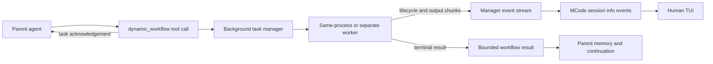

# Background workflow execution plane

`dynamic_workflow` crosses two execution planes and two output channels. Keeping those boundaries
separate lets a long workflow remain visible to a person without feeding its raw event stream back
into the parent model.

The agent plane ends when Mastra accepts an eligible background tool call. Mastra returns a task
acknowledgement with run metadata, allowing the parent agent to answer without waiting for the
workflow. The durable worker plane then owns the tool execution, workflow steps, retries,
suspension, resumption, cancellation, and terminal result. #decision/architecture/foundational

## Execution planes

Mastra can run both planes in one process with a full background-task manager. A split deployment
uses a producer manager on the API side and a worker manager on the execution side; storage and
PubSub carry task state, dispatch, output, and completion between them. The manager stream contract
is the same in both deployments. #decision/architecture/structural

The canonical tool implementation in
[`packages/agent-tools/src/dynamic-workflow.ts`](../packages/agent-tools/src/dynamic-workflow.ts)
bridges workflow writer chunks into the background task's output stream. Those chunks can include
workflow lifecycle events, nested agent text, provider-emitted reasoning payloads, tool calls and
results, errors, and final responses. They are observable runtime data; they are not a claim that
hidden chain-of-thought exists or is available. #constraint/security/hard

Mastra stores workflow agent entries against its regular agent-stream interface, while the host's
canonical registry exposes durable wrappers. Dynamic registration persists the definition, then
rehydrates it through Mastra's public API with a resolver that unwraps the already-registered
canonical agent. Each invocation receives a workflow-owned memory resource and isolated thread so
configured memory processors can run without appending nested messages to the parent's thread. No
agent definition is copied and no upstream source is patched. #decision/compatibility/structural

## Human and agent channels

The local MCode observer in
[`packages/mcode/src/background-task-observer.ts`](../packages/mcode/src/background-task-observer.ts)
subscribes with the active resource ID, filters for the exact `dynamic_workflow` tool ID, and emits
each running, output, completed, failed, cancelled, suspended, and resumed payload in arrival order.
MCode session `info` events are transient display events, so the TUI can keep rendering after the
original tool card closes without appending those payloads to the parent transcript.

The observer buffers startup payloads until the first rendered terminal write after MastraTUI sets
its title. This is the best readiness signal available through the public terminal injection seam,
but MastraTUI exposes no callback causally after initial chat replay. A queued renderer frame can
therefore theoretically release telemetry before replay clears the chat; the PTY/CUA acceptance
pass verifies current behavior but does not remove that upstream extension-point limitation. MCode
also proxies the public controller's resource change as a transaction: it opens the replacement
manager stream, buffers both sides while the session identity commits, then releases replacement
events and closes the prior stream. A failed commit restores old-resource delivery. The ordering is
necessary because the manager applies resource filtering when the stream is created rather than
including resource identity in each projected event.

The agent channel is intentionally narrower. Completion reaches memory through Mastra's background
task result injection, using the bounded `dynamic_workflow` result: workflow and run IDs, terminal
status, bounded step summaries, bounded final output, resumability, and truncation metadata. Raw
manager telemetry never enters that result. #requirement/architecture/critical

Observer shutdown aborts its manager subscription and awaits the reader before MCode stops the TUI.
Observation, formatting, or rendering failure is fail-open and cannot cancel or fail the workflow.
#requirement/operability/high

## Per-call background limitation

The tool declares `background.enabled: true`, and its model-facing description directs executable
`run` (`dryRun:false`) and `resume` calls to omit `_background` or set `_background.enabled:true`.
Validation-only `run` and `inspect` calls may use the foreground.

Mastra deliberately exposes `_background` as a model-controlled per-call modifier. An eligible tool
can therefore still be forced foreground with `_background.enabled:false`; the toolkit's contract is
strong guidance, not a framework guarantee. Removing that override would require an upstream change
or a fork, neither of which this repository adopts. #constraint/dependency/hard

## Provenance

The execution model and stream event families are documented in Mastra's
[Background tasks documentation](https://mastra.ai/docs/long-running-agents/background-tasks),
verified against the repository's pinned `@mastra/core@1.57.0`. The observed MCode failure and its
repair are tracked in [issue #184](https://github.com/rlabs88/mastra-toolkit/issues/184), following
the original tool delivery in [PR #168](https://github.com/rlabs88/mastra-toolkit/pull/168).
